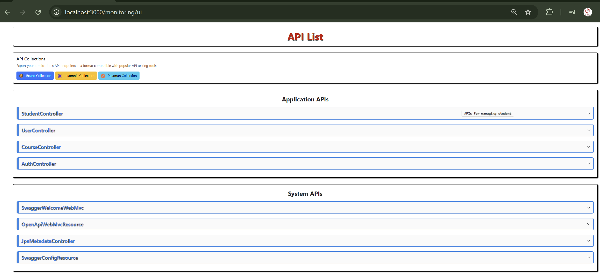
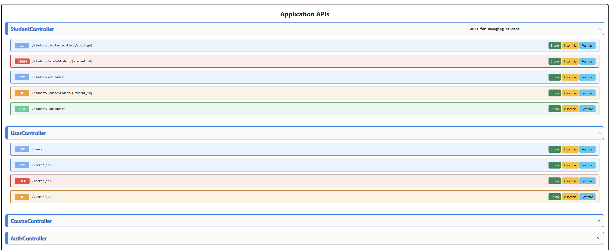
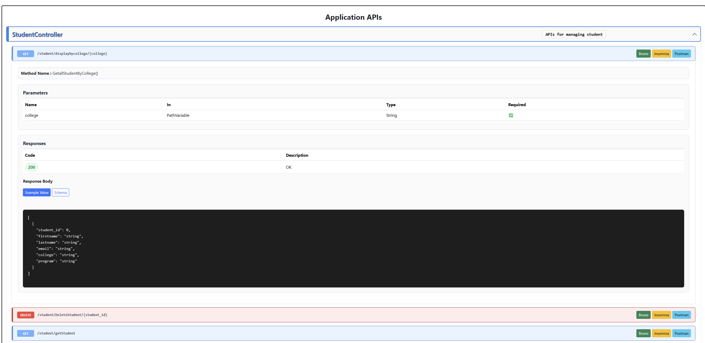
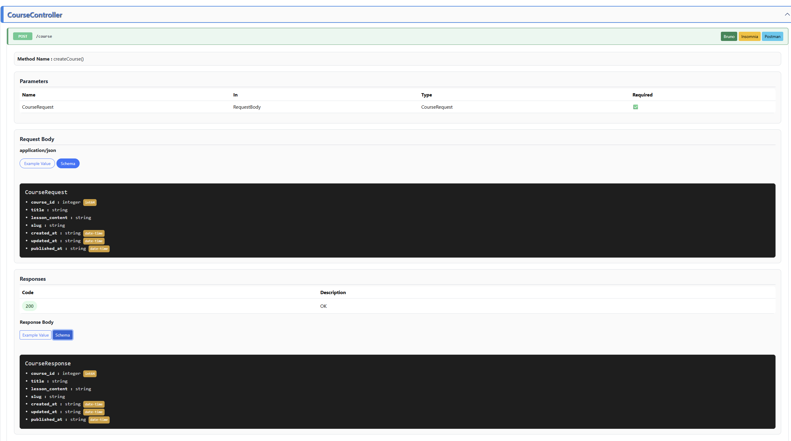
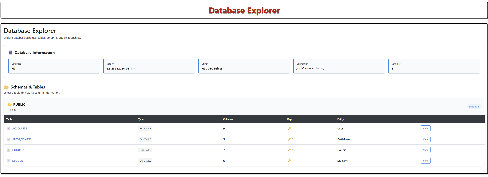
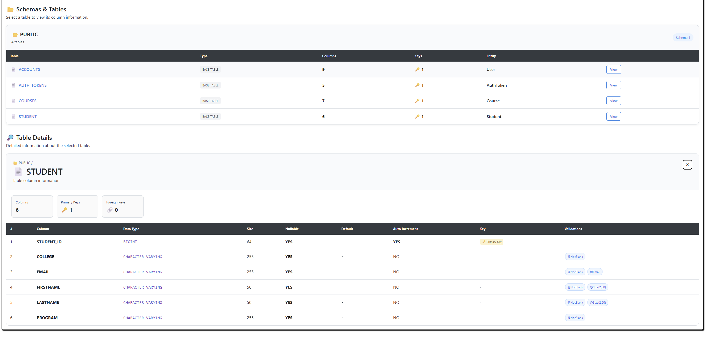

# API Monitoring Starter

API Monitoring Starter is a Spring Boot starter that automatically discovers controller endpoints, exposes a lightweight monitoring dashboard, and lets consumers export API documentation for Bruno, Insomnia, Postman, and OpenAPI.

## Features

The starter provides a practical API observability and documentation toolkit for Spring Boot applications:

- automatic discovery of Spring MVC controllers and endpoints
- a built-in monitoring dashboard at `/monitoring/ui` for browsing APIs
- a JSON API endpoint at `/monitoring/apis` for machine-readable access to discovered APIs
- optional database exploration at `/monitoring/database` when JPA entities and a datasource are available
- export support for Bruno, Insomnia, Postman, and OpenAPI
- lightweight integration through Spring Boot auto-configuration, so the monitoring components are registered automatically

## Main endpoints

- `GET /monitoring/apis` — returns discovered controllers and endpoints
- `GET /monitoring/ui` — serves the API monitoring dashboard
- `GET /monitoring/database` — serves the database explorer UI
- `GET /monitoring/export/openapi` — downloads OpenAPI JSON
- `GET /monitoring/export/postman/{id}` — downloads a single endpoint as Postman format
- `GET /monitoring/export/postman/collection/{type}` — downloads a full Postman collection
- `GET /monitoring/export/insomnia/{id}` — downloads a single endpoint as Insomnia format
- `GET /monitoring/export/insomnia/collection/{type}` — downloads an Insomnia collection
- `GET /monitoring/export/bruno/{id}` — downloads a single endpoint as Bruno format
- `GET /monitoring/export/bruno/collection/{type}` — downloads a Bruno collection

## How to use it

### 1. Build the starter

```bash
./mvnw clean install
```

### 2. Add it to a Spring Boot app

Include the starter as a dependency in the consuming application and start the app normally.

### 3. Open the UI

After the app starts, open:

- `http://localhost:8080/monitoring/ui`









- `http://localhost:8080/monitoring/database` (database explorer, when available)





## Development notes for contributors

- The auto-configuration lives in `src/main/java/com/example/api_monitoring_starter/autoconfigure/MonitoringAutoConfiguration.java`
- API discovery is handled by the scanner package
- Export logic is implemented in the exporter package
- Static UI assets are served from `src/main/resources/static/monitoring-ui`

## Future plans

The current database visibility support is focused on relational databases. A key future enhancement is adding compatibility for non-relational databases such as MongoDB, Cassandra, and Redis.

Planned areas of contribution include:

- Basic Read Operations for Tables in Database
- Advanced-level CRUD Operations with Role-Based Access Control
- Adding database adapters for non-relational stores
- Improving the database explorer experience for non-relational environments
- Ability to Export Database Schema and Table Creation
- Ability to Export Records of the Database
- Database-related metadata such as Pole Size, Current Connections, Table Storage Size, etc.

Contributors interested in this area are welcome to propose designs, implement adapters, and help shape the roadmap.

## Testing

Run the test suite with:

```bash
./mvnw test
```

## Contributing

Contributions are welcome. Please read [CONTRIBUTING.md](CONTRIBUTING.md) before opening a pull request.

## Code of Conduct

This project follows the Contributor Covenant. Please review [CODE_OF_CONDUCT.md](CODE_OF_CONDUCT.md) before participating.

## License

This project is licensed under the MIT License. See [LICENSE](LICENSE) for details.
